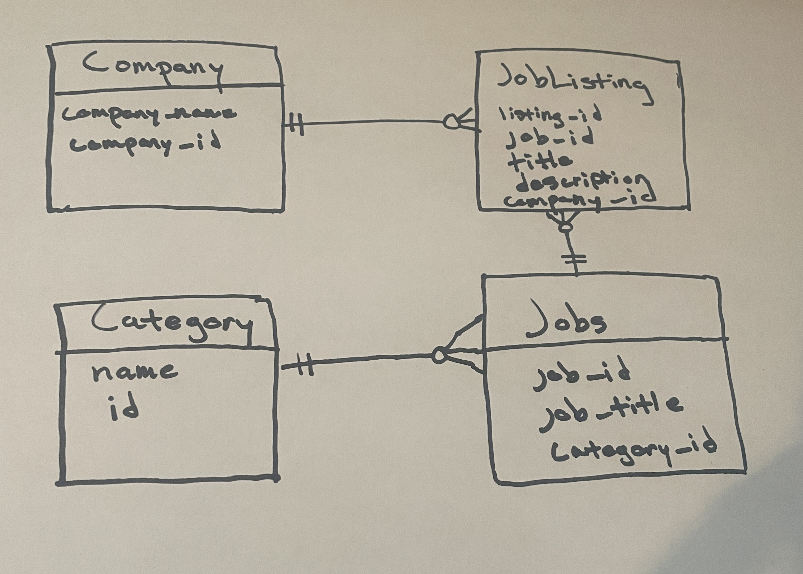

Description: Job Board Full Stack Project

Tech used: ASP.NET MVC 6.0, MS SQL Server, C#, HTML, CSS

The main database models are: Company, Category (Job Category), Job, and JobListing. See the Entity Relationship diagram below.

See the desktop version:

See the mobile version:

